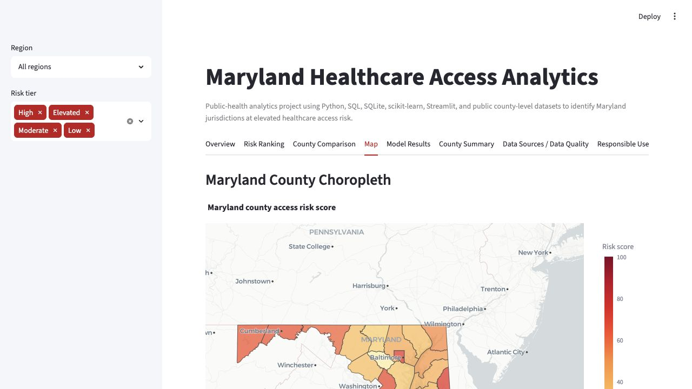
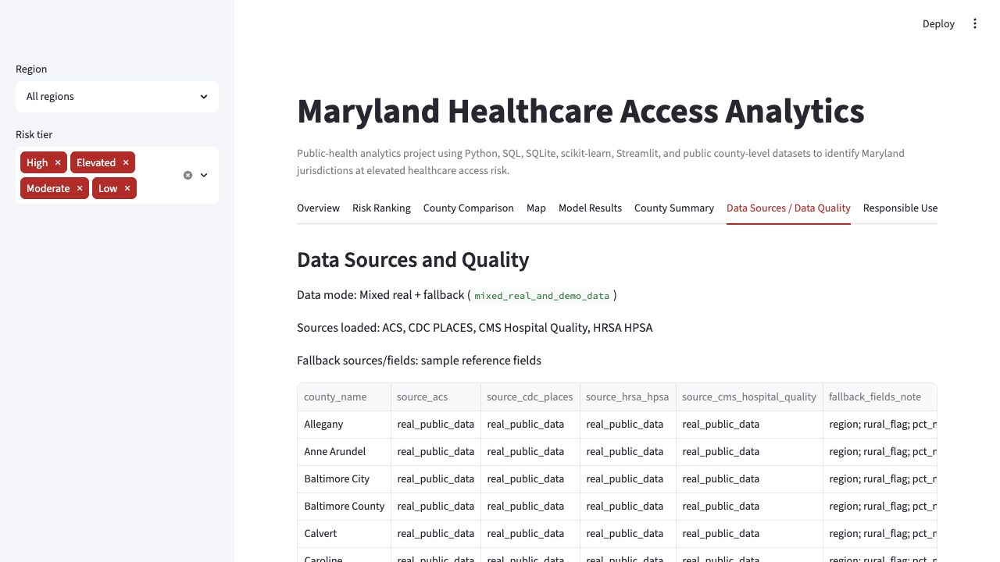

# Maryland Healthcare Access Analytics

[](https://github.com/bnjmnprto/maryland-healthcare-access-analytics/actions/workflows/project_checks.yml)

A public-health analytics project using Python, SQL, SQLite, scikit-learn, Streamlit, and public county-level datasets to identify Maryland jurisdictions at elevated healthcare access risk.

**Tech stack:** Python, pandas, SQLite, SQL, scikit-learn, Streamlit, Plotly, pytest, GitHub Actions

**Live dashboard:** https://maryland-healthcare-access-analytics.streamlit.app  
This link should be updated after Streamlit Community Cloud deployment.

**Run locally:** `streamlit run dashboard/app.py`


## 30-Second Employer Summary

This is an end-to-end healthcare analytics portfolio product for Maryland county-level access risk. The default pipeline now attempts real public data first, using ACS demographics, CDC PLACES health indicators, HRSA HPSA shortage data, and CMS hospital facility data when available. A documented sample fallback fills fields that those public feeds do not provide reliably, so the project remains reproducible.

The current committed run is `mixed_real_and_demo_data`: ACS, CDC PLACES, HRSA, and CMS loaded successfully, while several reference fields remain sample fallback values. The project uses aggregate county-level data only, not patient-level data.

## Employer Review Summary

This project demonstrates an end-to-end healthcare analytics workflow: public-data ingestion, sample fallback handling, SQL database design, data validation, county-level risk scoring, machine learning workflow documentation, Streamlit dashboarding, choropleth mapping, AI-style summarization, model-card documentation, testing, CI, and executive communication.

## Current Data Mode

The current data mode is recorded in `data/processed/run_metadata.json`.

- ACS: real public data via Census Reporter’s ACS API
- CDC PLACES: real public county-level health indicators
- HRSA HPSA: real public shortage-area downloads aggregated to county FIPS
- CMS Hospital General Information: real public hospital facility data aggregated to county
- Fallback fields: region, rural flag, nonwhite percentage, selected provider workforce rates, hospital beds, readmission proxy, preventable hospital stays, and life expectancy

The final feature table is `data/processed/healthcare_access_features.csv`.

## Why This Is Not A Clinical Decision Tool

This project uses county-level aggregate indicators. It does not diagnose disease, estimate individual risk, recommend treatment, determine eligibility, deny services, or allocate resources automatically. The access risk score is a transparent prioritization index for portfolio demonstration and planning discussion only.

## Screenshots








## Architecture Overview

```text
Public source fetchers + sample fallback scaffold
        |
        v
src/fetch_acs.py
src/fetch_cdc_places.py
src/fetch_hrsa_hpsa.py
src/fetch_cms_hospital_quality.py
        |
        v
src/data_pipeline.py
        |
        +--> data/processed/healthcare_access_features.csv
        +--> data/processed/dashboard_county_risk.csv
        +--> data/processed/run_metadata.json
        +--> data/processed/maryland_healthcare_access.db
        |
        v
src/validate_data.py ---> reports/data_quality_report.md + docs/validation_report.md
        |
        v
src/risk_model.py -----> model metrics, predictions, feature importance
        |
        v
src/ai_summary.py -----> plain-English county summaries
        |
        v
dashboard/app.py -----> Streamlit dashboard
```

## Data Pipeline

Default command:

```bash
python src/data_pipeline.py
```

The pipeline:

- Attempts real public ACS, CDC PLACES, HRSA, and CMS source extracts
- Uses cached processed public extracts when available to keep CI stable
- Falls back only for source fields that are unavailable or if public fetches fail
- Standardizes Maryland county FIPS codes
- Confirms all 24 county-equivalent jurisdictions, including Baltimore City
- Builds five risk components
- Writes processed CSVs, a SQLite database, and `run_metadata.json`

Refresh live public data:

```bash
make fetch-data
make live-pipeline
```

## Risk Score

The access risk score is a transparent 0-100 index, not a validated medical or operational score.

Components:

- Socioeconomic vulnerability
- Insurance and access burden
- Chronic disease burden
- Provider shortage burden
- Hospital availability/quality burden

Exact formulas and weights are documented in [docs/methodology.md](docs/methodology.md).

## SQL Layer

The SQLite database contains:

- `counties`
- `demographics`
- `health_outcomes`
- `provider_shortages`
- `hospital_quality`
- `access_risk_scores`
- `source_status`
- `final_feature_table`
- `model_outputs`

Run:

```bash
sqlite3 data/processed/maryland_healthcare_access.db < sql/queries.sql
sqlite3 data/processed/maryland_healthcare_access.db < sql/validation_queries.sql
```

SQL examples cover highest-risk jurisdictions, poverty and chronic burden, uninsured rates, provider shortage burden, weak hospital access, state-average comparisons, region-level risk components, and data completeness by source.

## ML Layer

Default command:

```bash
python src/risk_model.py
```

The model target hierarchy is:

1. HRSA provider shortage burden, when available
2. High poor/fair health rate from CDC PLACES
3. High uninsured rate from ACS
4. Demo rule-derived access-risk target as last fallback

The current default target is `high_hrsa_provider_shortage_burden` with target mode `independent_external`. HPSA-derived predictor fields are excluded when this target is used to avoid circular modeling.

Modeling caveat: Perfect or near-perfect metrics can occur with small county-level datasets and should not be interpreted as validated predictive performance.

Model documentation: [docs/model_card.md](docs/model_card.md)

## Dashboard Layer

The Streamlit dashboard includes:

- Overview and current data mode
- Maryland county risk ranking
- County comparison
- Maryland choropleth map with graceful fallback
- Model results and feature interpretation
- AI-style county summaries
- Data Sources / Data Quality tab
- Responsible-use section

Map hover fields include county name, risk score, top risk factor, and risk category.

## Responsible AI

`src/ai_summary.py` creates template-based summaries by default. It does not require an API key and does not send data to a paid API. Summaries use only values in the final county feature table and include a responsible-use caveat.

## Testing And CI

Run the full local check:

```bash
make all
```

Run tests only:

```bash
pytest
```

GitHub Actions workflow: `.github/workflows/project_checks.yml`

CI installs dependencies, runs `make all`, then runs `pytest`. The pipeline uses committed/cached processed public extracts when available so CI is not fragile if a public endpoint is temporarily unavailable.

## Deploying on Streamlit Community Cloud

Use these manual settings in [Streamlit Community Cloud](https://streamlit.io/cloud):

| Setting | Value |
| --- | --- |
| Repository | `bnjmnprto/maryland-healthcare-access-analytics` |
| Branch | `main` |
| Main file path | `dashboard/app.py` |
| App URL suggestion | `maryland-healthcare-access-analytics` |
| Python runtime | `python-3.11` via `runtime.txt` |

The deployed app does not require private secrets, API keys, patient data, or startup data downloads. It loads committed processed outputs from `data/processed/` and the committed Maryland county GeoJSON from `data/raw/maryland_counties.geojson`.

The deployed Streamlit URL is listed near the top of this README.

Local launch command:

```bash
streamlit run dashboard/app.py
```

## Documentation

- Data sources: [docs/data_sources.md](docs/data_sources.md)
- Data dictionary: [docs/data_dictionary.md](docs/data_dictionary.md)
- Data provenance: [docs/data_provenance.md](docs/data_provenance.md)
- Methodology: [docs/methodology.md](docs/methodology.md)
- Model card: [docs/model_card.md](docs/model_card.md)
- Validation report: [docs/validation_report.md](docs/validation_report.md)
- Data quality report: [reports/data_quality_report.md](reports/data_quality_report.md)
- Executive summary: [reports/executive_summary.md](reports/executive_summary.md)
- Portfolio case study: [reports/portfolio_case_study.md](reports/portfolio_case_study.md)
- Interview talking points: [docs/interview_talking_points.md](docs/interview_talking_points.md)
- Portfolio checklist: [docs/portfolio_checklist.md](docs/portfolio_checklist.md)

## Makefile Commands

```bash
make setup
make fetch-data
make data
make validate
make model
make summaries
make dashboard
make test
make all
```

## Repository

GitHub repository: `bnjmnprto/maryland-healthcare-access-analytics`

## GitHub Repository Description

A public-health analytics project using Python, SQL, SQLite, scikit-learn, Streamlit, and public county-level datasets to identify Maryland jurisdictions at elevated healthcare access risk.

Suggested GitHub topics:

`healthcare-analytics` `public-health` `data-science` `python` `sql` `sqlite` `streamlit` `machine-learning` `responsible-ai` `portfolio-project` `maryland` `acs` `cdc-places` `hrsa` `cms`

## Resume Bullet

Built Maryland Healthcare Access Analytics, a public-health analytics project using Python, SQL, SQLite, scikit-learn, and Streamlit; integrated ACS, CDC PLACES, HRSA, and CMS county-level public data with documented fallback handling, engineered transparent access-risk indicators, trained a reproducible ML workflow with target caveats, wrote SQL analysis queries, and built an employer-facing dashboard with validation, CI, and responsible-use documentation.

More role-specific bullets: [resume_bullets.md](resume_bullets.md)
