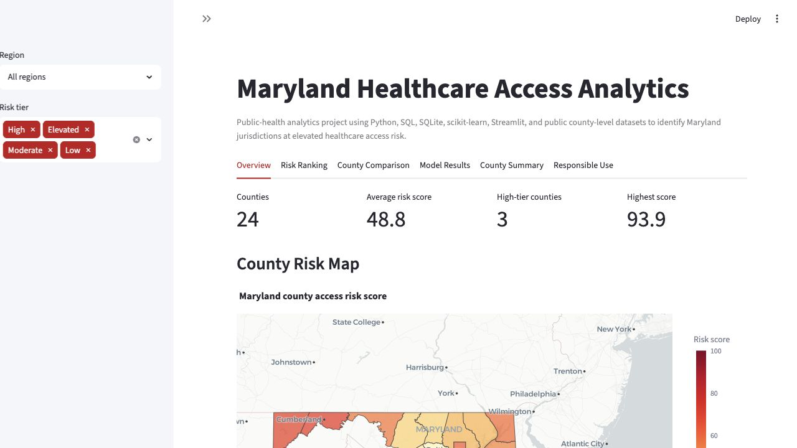
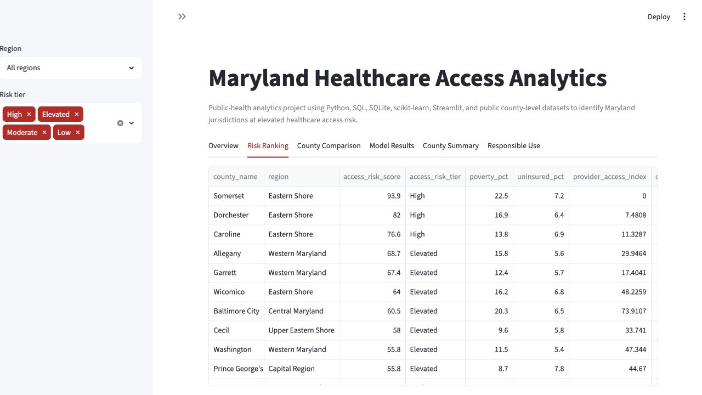
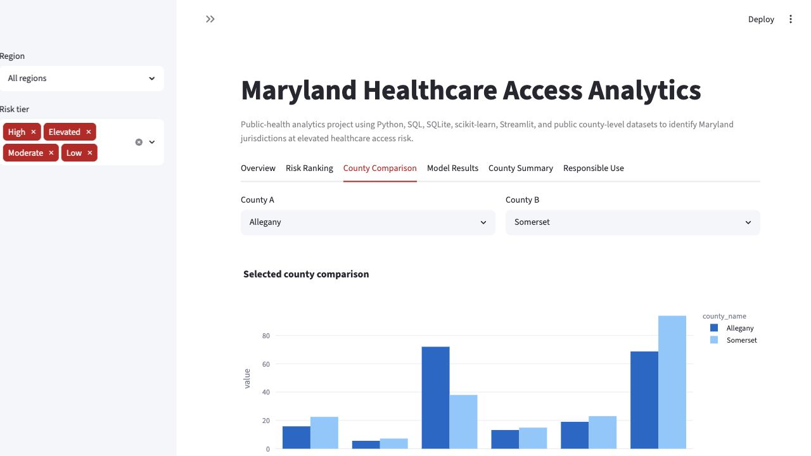
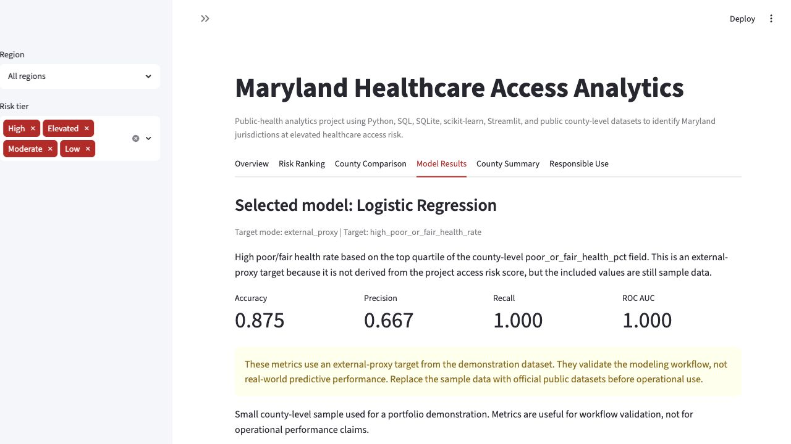
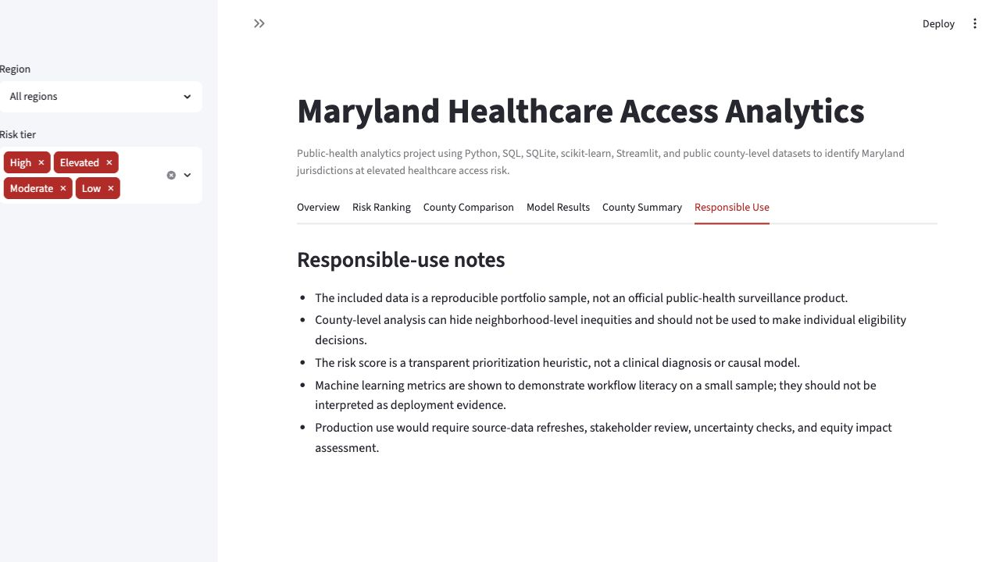

# Maryland Healthcare Access Analytics

[](https://github.com/bnjmnprto/community-health-access-analytics/actions/workflows/project_checks.yml)

A public-health analytics project using Python, SQL, SQLite, scikit-learn, Streamlit, and public county-level datasets to identify Maryland jurisdictions at elevated healthcare access risk.

**Tech stack:** Python, pandas, SQLite, SQL, scikit-learn, Streamlit, Plotly, pytest, GitHub Actions

**Live dashboard:** Coming soon  
This link should be updated after Streamlit Community Cloud deployment.

**Run locally:** `streamlit run dashboard/app.py`



## 30-Second Employer Summary

This project is a deployable healthcare analytics portfolio product. It cleans Maryland county-level data, supports optional public-data ingestion with sample fallback, builds a SQLite database, runs SQL analysis, engineers transparent access risk indicators, trains demonstration ML models with clear target-mode documentation, creates AI-style plain-English summaries, and presents everything in a Streamlit dashboard with tests, CI, deployment config, screenshots, model card, data quality report, and responsible-use caveats.

The current committed data is a portfolio simulation with optional public-data ingestion for selected fields. It does not use patient-level data and should not be interpreted as a validated clinical or public-health decision tool.

## Employer Review Summary

This project demonstrates an end-to-end healthcare analytics workflow: public-data ingestion, sample fallback handling, SQL database design, data validation, county-level risk scoring, machine learning workflow documentation, Streamlit dashboarding, choropleth mapping, AI-style summarization, model-card documentation, testing, CI, and executive communication.

## What This Project Demonstrates

- Python data cleaning and reproducible pipeline design
- SQL schema design and SQLite querying
- Healthcare analytics and public-health-style feature engineering
- Maryland county choropleth mapping with graceful fallback
- Machine learning workflow with external-proxy and demo target modes
- Model output documentation through a model card
- Streamlit dashboard design for stakeholder review
- Template-based AI-style summarization without an API key
- Responsible AI and healthcare analytics caveats
- Data validation, pytest tests, Makefile commands, and GitHub Actions CI
- Executive communication through a public-health analytics brief and case study

## Why This Matters For Healthcare Analytics

Healthcare access barriers often overlap. A county may show provider shortages, high poverty, high uninsured rates, chronic disease burden, limited hospital capacity, or several of those signals at once. A healthcare analyst needs to organize those signals into a clear workflow that supports prioritization and discussion without implying clinical certainty.

This project shows how to move from raw county indicators to SQL tables, risk features, model outputs, map-based dashboarding, and executive-ready communication.

## Responsible-Use Caveat

This is a professional portfolio project with a default sample dataset and optional live public-data ingestion. The sample findings are not validated public-health conclusions. The dashboard supports analytics demonstration and planning conversations only. It should not be used for diagnosis, treatment, individual eligibility decisions, funding denial, or automated resource allocation.

## Data Mode And Scope

- Default mode uses the committed sample/demo dataset so the project is reproducible without network access.
- Live-data mode can ingest selected public datasets from CDC PLACES, HRSA HPSA downloads, and CMS Provider Data, while retaining documented sample fallback values for fields not covered by those feeds.
- The project does not use patient-level data.
- The machine learning model is for workflow demonstration unless a production real-data mode is completed and validated against an official external outcome.
- The dashboard is not a clinical, operational, eligibility, funding, or automated decision tool.

## Why This Is Not A Clinical Decision Tool

This project uses county-level aggregate indicators, not patient-level records. It does not diagnose disease, estimate individual risk, recommend treatment, or determine eligibility for care. The score is a transparent planning heuristic for portfolio demonstration, and any real-world public-health use would require official data lineage, stakeholder review, statistical validation, uncertainty analysis, and equity review.

## Dashboard Screenshots









## Architecture Overview

```text
Sample or optional public raw data + Maryland county GeoJSON
        |
        v
src/public_data_ingestion.py (optional live-data path)
        |
        v
src/data_pipeline.py
        |
        +--> data/processed/dashboard_county_risk.csv
        +--> data/processed/model_feature_table.csv
        +--> data/processed/maryland_healthcare_access.db
        |
        v
src/validate_data.py ---> reports/data_quality_report.md
        |
        v
src/risk_model.py -----> model metrics, predictions, feature importance
        |
        v
src/ai_summary.py -----> plain-English county summaries
        |
        v
dashboard/app.py -----> Streamlit dashboard
```

## Data Pipeline

`src/data_pipeline.py`:

- Loads `data/raw/maryland_county_health_access_sample.csv`
- Can also process `data/raw/maryland_county_health_access_public.csv` generated by `make live-data`
- Validates required columns
- Standardizes county FIPS codes
- Creates four risk components:
  - Provider access gap
  - Socioeconomic need
  - Chronic disease burden
  - Hospital quality/capacity gap
- Calculates `access_risk_score`
- Adds `top_risk_factor` for dashboard and map tooltips
- Writes processed CSVs and a SQLite database

Optional public-data ingestion:

```bash
make live-data
make live-pipeline
```

The live ingestion script pulls public data from CDC PLACES, HRSA HPSA downloads, and CMS Provider Data where feasible, then keeps documented sample fallback values for fields not covered by those feeds. Provenance is documented in [docs/data_provenance.md](docs/data_provenance.md) and [data/raw/source_manifest.json](data/raw/source_manifest.json).

## SQL Layer

The SQLite database contains:

- `counties`
- `demographics`
- `health_outcomes`
- `provider_shortages`
- `hospital_quality`
- `access_risk_scores`

Run:

```bash
sqlite3 data/processed/maryland_healthcare_access.db < sql/queries.sql
```

The SQL file answers:

- Which counties have the highest access risk?
- Which counties combine high poverty, high uninsured rates, and poor provider access?
- Which counties have worse chronic disease burden?
- How do counties compare to the Maryland average?

## ML Layer

`src/risk_model.py` supports two target modes:

**Default: `external_proxy`**

- Target: `high_poor_or_fair_health_rate`
- Source: top quartile of `poor_or_fair_health_pct`
- Why it is stronger: it is not derived from the project’s access risk score.
- Caveat: the current field is still sample portfolio data and must be replaced with official public data for production.

**Optional: `demo_score`**

- Target: `high_access_risk`
- Source: top quartile of the project’s own access risk score
- Use: demonstration-only workflow mode

Run:

```bash
python src/risk_model.py
python src/risk_model.py --target-mode demo_score
```

Model documentation: [docs/model_card.md](docs/model_card.md)

## Dashboard Layer

The Streamlit dashboard includes:

- Overview metrics
- Maryland county choropleth map using `data/raw/maryland_counties.geojson`
- Graceful map fallback to the risk ranking table
- County risk ranking
- County comparison tool
- Model results and feature importance
- Template-based AI-style county summary
- Responsible-use section

Map hover fields include county name, risk score, top risk factor, and risk category.

## Responsible AI Section

`src/ai_summary.py` creates template-based summaries by default. It does not require an API key and does not send data to a paid API. Any future LLM integration should use only aggregate county-level metrics, avoid patient-level data, and go through organizational review.

## Testing And CI

Run the full local check:

```bash
make all
```

Run tests only:

```bash
pytest
```

GitHub Actions workflow:

- `.github/workflows/project_checks.yml`

The workflow installs dependencies, runs the data pipeline, validates data, trains the model, generates summaries, and runs pytest.

## Deployment Instructions

### Streamlit Community Cloud

1. Push this repository to GitHub.
2. Go to [Streamlit Community Cloud](https://streamlit.io/cloud).
3. Create a new app from the GitHub repository.
4. Set the main file path to:

```text
dashboard/app.py
```

5. Confirm `requirements.txt` is in the repository root.
6. Deploy.

Local command:

```bash
streamlit run dashboard/app.py
```

Deployment config:

- `.streamlit/config.toml`

## Future Production Version With Official Public Datasets

The repository includes sample data so it runs locally and an optional public-data ingestion script for selected fields. A production version should fully replace remaining sample fallback values with official public datasets:

- [U.S. Census ACS 5-year data](https://www.census.gov/data/developers/data-sets/acs-5year.html)
- [CDC PLACES](https://www.cdc.gov/places/)
- [HRSA Data Warehouse shortage areas](https://data.hrsa.gov/topics/health-workforce/shortage-areas)
- [CMS Provider Data](https://data.cms.gov/provider-data/)
- [County Health Rankings & Roadmaps](https://www.countyhealthrankings.org/health-data/methodology-and-sources/data-documentation)
- [Maryland Open Data](https://opendata.maryland.gov/)

Future upgrade plan: [docs/future_real_data_upgrade.md](docs/future_real_data_upgrade.md)

## Documentation

- Data dictionary: [docs/data_dictionary.md](docs/data_dictionary.md)
- Data provenance: [docs/data_provenance.md](docs/data_provenance.md)
- Methodology: [docs/methodology.md](docs/methodology.md)
- Model card: [docs/model_card.md](docs/model_card.md)
- Interview talking points: [docs/interview_talking_points.md](docs/interview_talking_points.md)
- Portfolio checklist: [docs/portfolio_checklist.md](docs/portfolio_checklist.md)
- Data quality report: [reports/data_quality_report.md](reports/data_quality_report.md)
- Executive summary: [reports/executive_summary.md](reports/executive_summary.md)
- Portfolio case study: [reports/portfolio_case_study.md](reports/portfolio_case_study.md)

## Project Structure

```text
.
├── .github/workflows/project_checks.yml
├── .streamlit/config.toml
├── Makefile
├── dashboard/app.py
├── data/raw/
├── data/processed/
├── docs/
├── reports/
├── sql/
├── src/
│   ├── public_data_ingestion.py
│   └── data_pipeline.py
├── tests/
├── pytest.ini
├── README.md
├── requirements.txt
└── resume_bullets.md
```

## Makefile Commands

```bash
make setup
make live-data
make live-pipeline
make data
make validate
make model
make summaries
make dashboard
make test
make all
```

## Modeling Caveat

The current model uses a small demonstration dataset by default. Even when the default target is not derived from the access risk score, the data values are still sample values unless the optional live-data path is completed and reviewed. Metrics are useful for workflow validation, not operational predictive performance. A production model should be trained and validated against an external observed outcome such as preventable hospitalizations, avoidable emergency department visits, ambulatory care sensitive admissions, appointment wait times, or unmet care due to cost.

## Repository Rename Note

The current GitHub remote is still `bnjmnprto/community-health-access-analytics`. After this upgrade branch is reviewed and approved, rename the GitHub repository to `maryland-healthcare-access-analytics` and update badges, deployment links, and any portfolio URLs. Do not rename the remote before review.

## GitHub Repository Description

A public-health analytics project using Python, SQL, SQLite, scikit-learn, Streamlit, and public county-level datasets to identify Maryland jurisdictions at elevated healthcare access risk.

Suggested GitHub topics:

`healthcare-analytics` `data-science` `python` `sql` `sqlite` `streamlit` `machine-learning` `public-health` `responsible-ai` `portfolio-project`

## Resume Bullet

Built Maryland Healthcare Access Analytics, a public-health analytics portfolio project using Python, SQL, SQLite, scikit-learn, and Streamlit; engineered county-level risk indicators, added optional public-data ingestion with sample fallback, trained demonstration ML models, wrote SQL analysis queries, and documented responsible-use limitations for public-health planning.

More role-specific bullets: [resume_bullets.md](resume_bullets.md)
